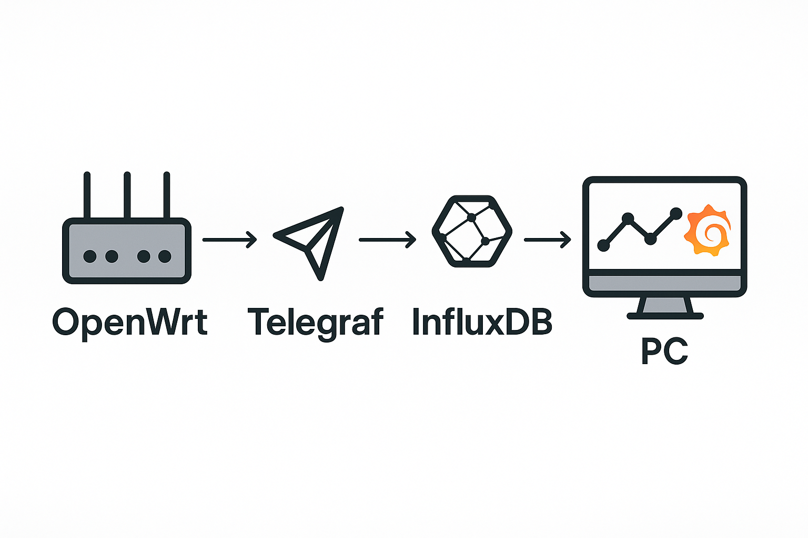
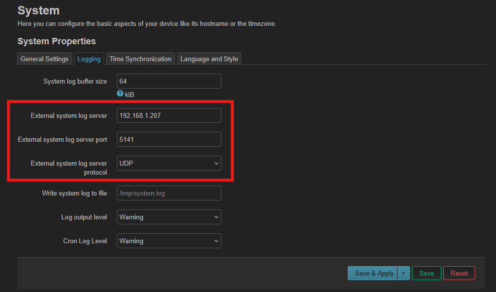
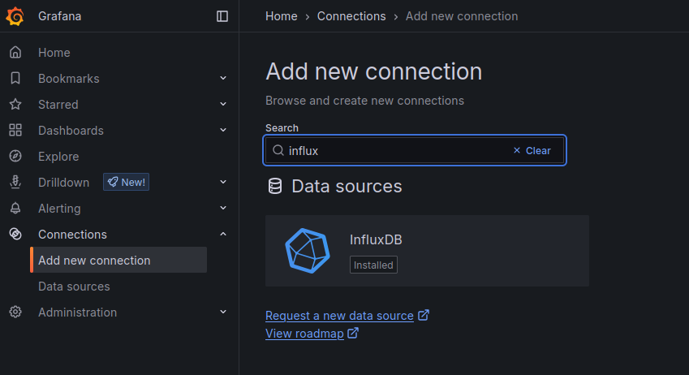
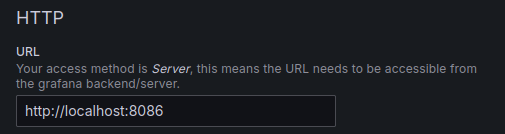
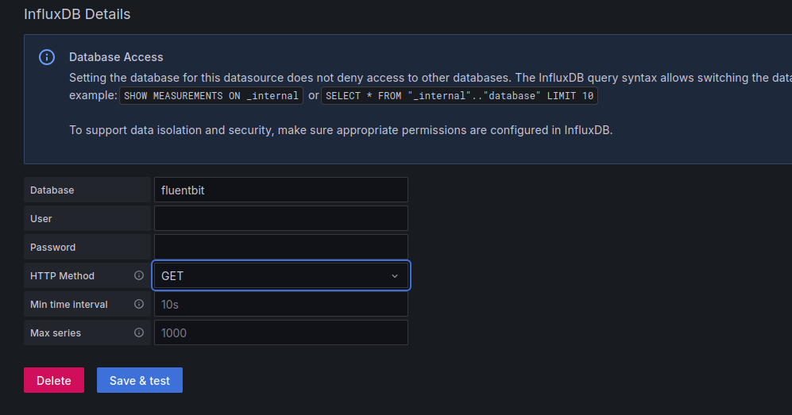
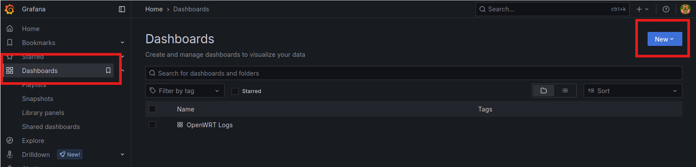
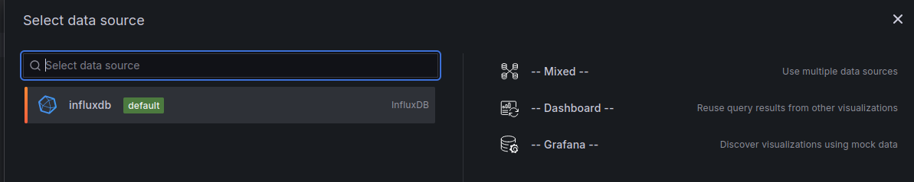
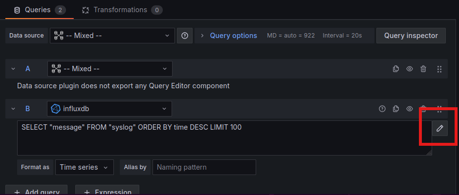
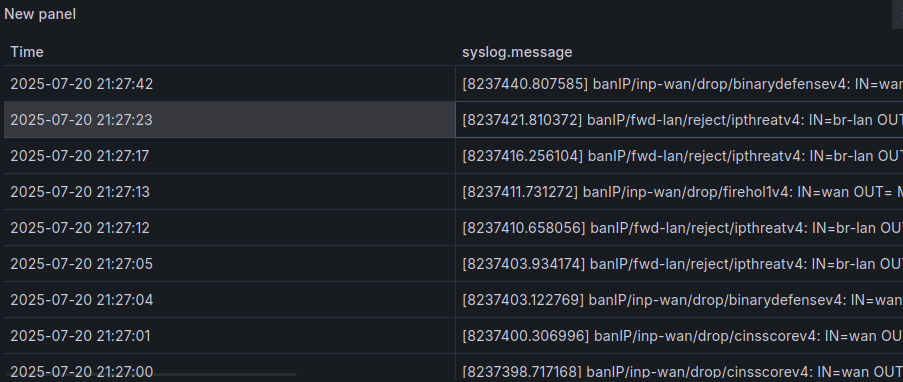

---
categories:
  - Freetime
layout: post
image:
  path: hacking.png
media_subpath: /assets/posts/2025-07-18-SimpleSIEM/
tags:
  - Experiencing
title: Homelab - Testing Lightweight Stack SIEM
---

## Introduction



*This project started from a small curiosity. I was casually checking the logs on my OpenWrt router (while using BanIP), and I noticed that there's a surprising amount of traffic hitting my router — way more than I expected. It got me wondering: where is all this traffic coming from, and what kind of IP addresses are trying to reach my device?*

*To get a better understanding of this, I wanted to build a small monitoring and visualization system. The goal is to collect incoming traffic logs from the router, forward them to a separate PC, and use tools like Fluentbit, InfluxDB, and Grafana to visualize the data. This way I can get a clearer picture of the patterns, countries of origin, and possibly suspicious sources that interact with my network.*

*It’s not a huge setup, but it gives me a hands-on way to learn more about the traffic flows around my router and build a simple yet useful traffic analysis system.*

*Tips: If you are too tired to write things down, just use AI to literature your own thoughts or instructions and paste them here.*

### Installation

*Updating the UbuntuVM and installing the necessary programs (influxdb, fluent-bit and grafana)*

````
sudo apt install influxdb grafana
curl https://raw.githubusercontent.com/fluent/fluent-bit/master/install.sh | sh --- One liner for fluent-bit install
````
*It's pretty straightforward to set up log forwarding from your OpenWrt router. You just need to point the logs to the correct IP address of your log receiver (e.g., your PC or server), make sure the destination port is open and available, and then choose UDP as the protocol for sending logs. Once that's set, your router will start forwarding logs in real-time to the target system. Picture from the system settings as an example.*



*Or via command line like this*
````
uci set system.@system[0].log_ip='192.168.1.100'  # Fluentbit/Grafana Server IPv4 address
uci set system.@system[0].log_port='6514'         # Port number
uci commit system
/etc/init.d/log restart
````

**Create database for the logs in influxdb:**
````
user@Ubuntu-20:~/Desktop$ influx
Connected to http://localhost:8086 version 1.6.4
InfluxDB shell version: 1.6.4
> CREATE DATABASE fluentbit;
> SHOW DATABASES
name: databases
name
----
_internal
fluentbit
> exit

````

**Configure Fluentbit (/etc/fluent-bit/fluent-bit.conf):**

````
[SERVICE]
    Flush        5
    Daemon       Off
    Log_Level    info
    Parsers_File parsers.conf

[INPUT]
    Name          syslog
    Mode          udp
    Listen        0.0.0.0
    Port          6514
    Parser        syslog-3164
    Tag           syslog

[OUTPUT]
    Name          influxdb
    Match         *
    Host          127.0.0.1 #localhost
    Port          8086
    Database      fluentbit
    Sequence_Tag  message
````

*After configurations run:*
````
sudo systemctl restart fluent-bit
````

## Grafana Dashboard

*After setting up InfluxDB, getting it configured properly, and installing both Grafana and Fluent Bit, we’re now at the point where we can actually start connecting things together. This is the part I’ve been waiting for — taking all the data that’s been collected and finally visualizing it.*

*So the next thing is to go into Grafana, and from there, we’ll add InfluxDB as a data source. It’s pretty straightforward: you just choose *InfluxDB*, give it the URL (for me it’s `http://localhost:8086`), and then define the database name we’ve been using — in this case, `telegraf`.*

*Once that’s connected and tested successfully, we can move on to creating our dashboard. I built panels that show recent logs, top programs sending syslog events, and traffic over time. It’s actually quite satisfying to watch all that information come together into something visual — especially after setting up the whole pipeline from scratch.*

*Setting up the Grafana-server:*
````
sudo systemctl start grafana-server
sudo systemctl enable grafana-server
sudo systemctl status grafana-server --- Just to make sure its enabled, otherwise you cannot access http://localhost:3000
````
*Open browser and login, default credentials are admin:admin, but change the password.*
*Go to connections and add a new data source and search influx*



**Server IP:**



**Database name and HTTP method either GET or POST, later you can enable authentication and setup user and password**



*Create a new dashboard:*



*Select the Influxdb as datasource and set Mixed:*



*Edit the query and input this to see any data in the database:*
````
SELECT "message" FROM "syslog" ORDER BY time DESC LIMIT 100
````



*When the Grafana refreshes shortly after, logs should appear in to the table*

