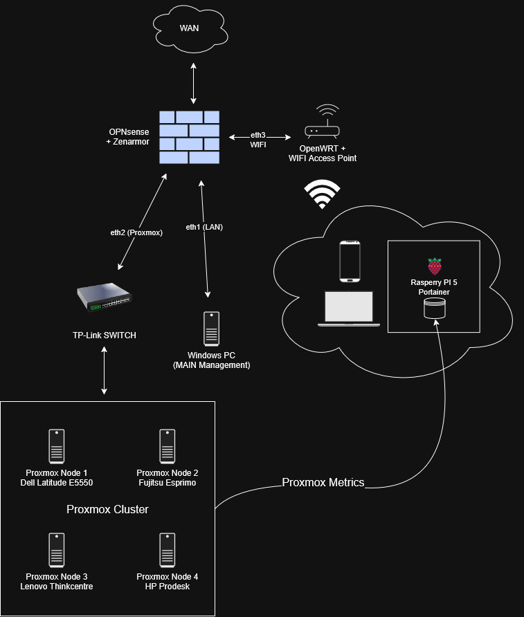
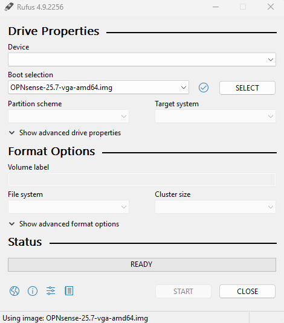
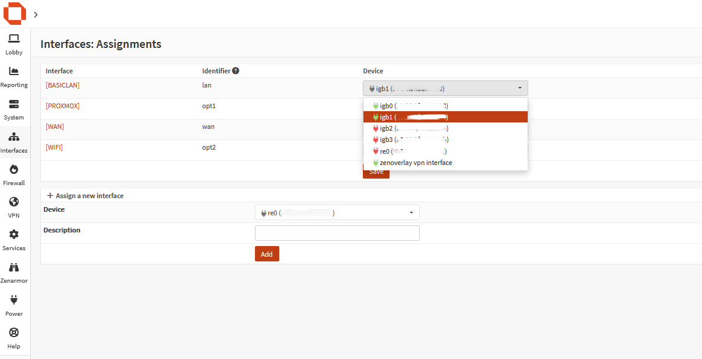
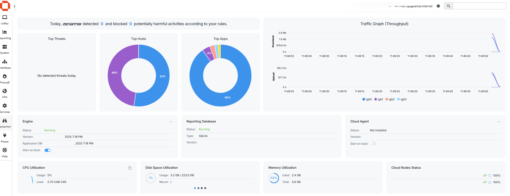
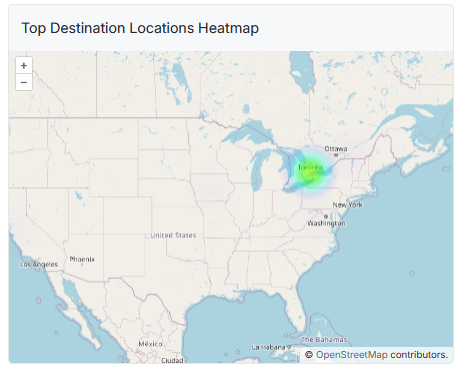
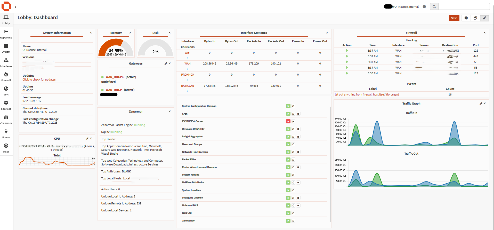

---
categories:
  - Freetime
layout: post
image:
  path: hacking.png
media_subpath: /assets/posts/2025-10-02-OPNsense
tags:
  - Experiencing
  - Freetime
title: Homelab - OPNsense & Zenarmor
---

## My Current Homelab Topology – Implementing OPNsense & Zenarmor

## Topology




## Expanding the Homelab: First Steps with OPNsense  

After getting the basics of my lab together, it was time to bring in a proper firewall/router setup. I decided to go with **OPNsense**, since it’s open source, actively developed, and offers a lot of flexibility for future integrations.  

## Installing OPNsense  

I grabbed the most recent **OPNsense VGA image** and flashed it onto a USB stick using **Rufus**. 



With the stick ready, I booted up my new machine – equipped with a 4-port NIC – and kicked off the installation.  
To actually install OPNsense onto the local hard drive (instead of just running from the live USB), you need to log in with the user **`installer`** after boot. From there, you can choose between **UFS** or **ZFS** for the target disk.  
(These steps are well-documented in the official OPNsense documentation if you need more detail.)   

## Interface Assignment  

Next came the fun part: assigning the network interfaces. My machine has four Ethernet ports, and I set them up like this:  

- **eth0 → WAN**  
- **eth1 → LAN**  
- **eth2 → Proxmox LAN**  
- **eth3 → Wi-Fi**  



For now, I’ve enabled **DHCP on the WAN and LAN interfaces**, so things can talk to each other while I prepare the rest. The **Proxmox LAN** and **Wi-Fi port** are left as-is until I configure bridging and routing in more detail. Interfaces can be assigned easily by selecting the device based on ports connected and adding a description for the new interface.

## Zenarmor Installation  

To get visibility and security features, I also installed **Zenarmor**. The installation process is simple through the OPNsense UI:  

1. Go to **System → Firmware → Plugins**  
2. Select **Enterprise Security Extensions for OPNsense (ZENARMOR)**  
3. Install it — this also pulls in the **Zenarmor Updater** automatically.  

### Logs from installation

````
***GOT REQUEST TO INSTALL***
Currently running OPNsense version (hmm) at Thu Oct  2 07:45:14 UTC 2025
Updating OPNsense repository catalogue...
OPNsense repository is up to date.
Updating SunnyValley repository catalogue...
SunnyValley repository is up to date.
All repositories are up to date.
The following 3 package(s) will be affected (of 0 checked):

New packages to be INSTALLED:
	os-sensei: version [SunnyValley]
	os-sensei-updater: version [SunnyValley]
	ubench: version [SunnyValley]

Number of packages to be installed: 3
````

Fresh install requires configuration the interfaces to be assigned for monitoring. In this part I used all the available interfaces. Dashboard looks like this. 



The **Reports** section of Zenarmor is really useful to get insights of the traffic as for example. **Heatmaps**



## Current Status  

At this stage, everything is working as expected: internet is flowing, LAN devices are happy, and the OPNsense box is ready to grow with the rest of my homelab.  

Since I also configured **Zenarmor** using local database (SQLite) to export logs, I plan to run a dedicated database instance later in my **Proxmox environment**. This will prevent log files from piling up directly on the firewall device and keep things cleaner long-term.  

The next steps will be:  

- Configuring the **bridge for the Wi-Fi router (OpenWRT)**  
- Setting up the **Proxmox LAN** for virtualized workloads  
- Fine-tuning firewall rules, VLANs and services  


 

So far, the experience has been smooth, and I’m excited about layering in more complexity piece by piece.  


