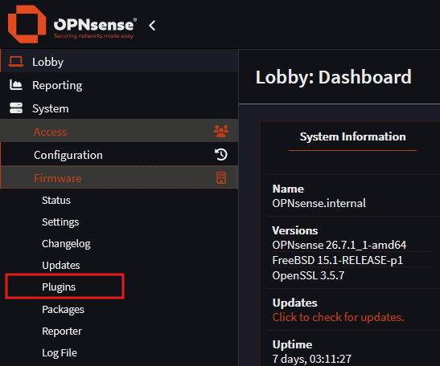
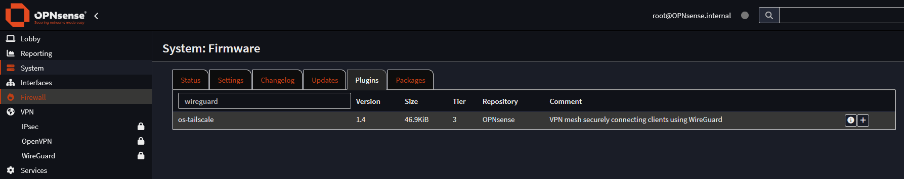
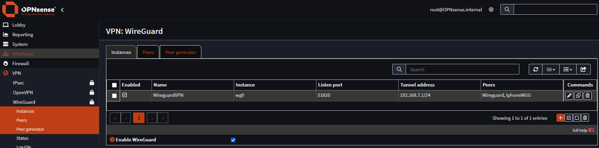
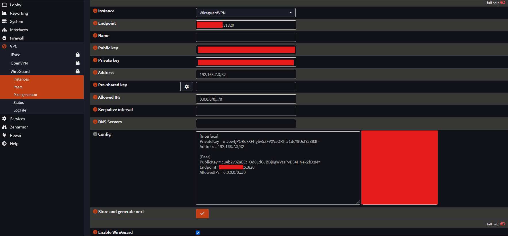
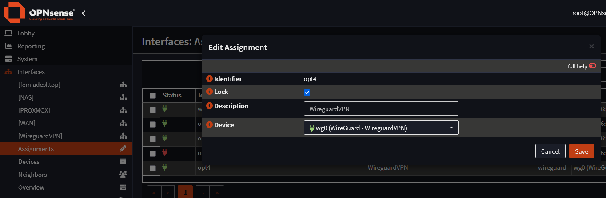
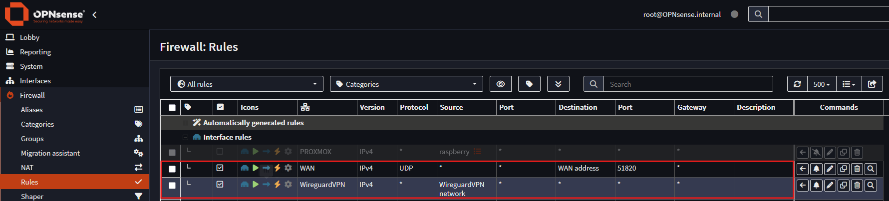

---
categories:
  - Freetime
layout: post
image:
  path: hacking.png
media_subpath: /assets/posts/2026-07-26-WireguardOPN
tags:
  - Experiencing
  - Freetime
  - BurnoutSurvivor
  - 
title: Homelab - Implementing WireGuard Tunnel To Homelab
---
## Description

While my time at hospital I was curious about testing OPNSense plugin to make a Wireguard VPN-tunnel to access my homelab environment from outside.

- Wireguard official site : <https://www.wireguard.com/>
- Tutorial for implementing Wireguard : <https://www.zenarmor.com/docs/network-security-tutorials/how-to-setup-wireguard-on-opnsense>

## Deployment

OPNsense plugins section can be found under firmware, there you can find the Wireguard plugin.

After installation, move to VPN-section from the menu and go to instances. Here are the settings I made for the single VPN-instance. By default the port is 51820 and specifying the tunnel address not overlapping any other interfaces.

Choose *Peer Generator*

Select the newly created instance and specify endpoint address. For me it was the public IP-address of the router. Can be found via google. Then generate new keys both public and private for the peer. Copy these settings with QR-code to the peer device. I have made connections for Macbook and IPhone. Also *enable Wireguard* from the bottom in order to make connections.

New interface has been created to your *assignments* section and enable the Wireguard interface. 

Making changes to the firewall rules to allow connections into your homelab environment.

Following rules allows from WAN to WAN port 51820 connections. This port can be different for you but I used the default.
Second rule allows traffic from the new interface into Wireguard network.

After this tested my connections from phone and laptop, I was able to connect into all devices in my homelab - Proxmox - Raspberry PI and NAS-server.