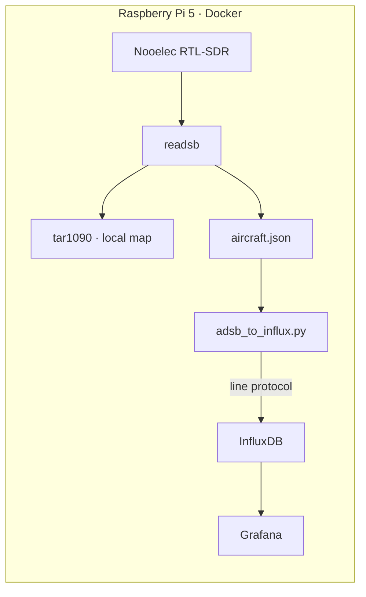

---
categories:
  - Freetime
layout: post
mermaid: true
image:
  path: Starting.png
media_subpath: /assets/posts/1970-01-01-readsb-grafana
tags:
  - Experiencing
  - Freetime
  - SDR
  - Grafana
  - InfluxDB
title: Homelab - ADS-B Metrics - readsb to Grafana via InfluxDB
description: >-
  Collect ADS-B aircraft metrics from readsb/tar1090 on a Raspberry Pi,
  store time-series data in InfluxDB with a Python collector, and visualize
  trends in Grafana alongside the existing tar1090 map.
---

## Description

After setting up **readsb** on my Raspberry Pi, **tar1090** already provides a live aircraft map on the local network. That covers *what is in the sky right now*, but I also wanted **historical metrics** — aircraft count over time, maximum range, average altitude — in **Grafana**, using the **InfluxDB** container already running on the same Pi.

This post documents the pipeline:

**RTL-SDR → readsb → tar1090 (map) + aircraft.json → Python collector → InfluxDB → Grafana**

Related earlier posts:

- [Nooelec SDR on Raspberry Pi](/posts/homelab-rf-experience-nooelec-nesdr-smart-v5/)
- [rtl_433 + MQTT + HAOS](/posts/homelab-rf-experience-haos-sdr-datacenter-mqtt-sdr/)

Useful links:

- readsb: <https://github.com/wiedehopf/readsb>
- tar1090: <https://github.com/wiedehopf/tar1090>
- InfluxDB docs: <https://docs.influxdata.com/influxdb/>

## Architecture



**Note:** One RTL-SDR dongle can usually only be used by one process at a time. Stop **rtl_433** (or other SDR containers) while **readsb** is running, or use a second dongle.

## Prerequisites

Hardware and software already in place:

- Raspberry Pi with **readsb** and **tar1090** (map reachable on LAN)
- **InfluxDB** and **Grafana** in Docker (Portainer)
- Receiver latitude/longitude (for distance calculations)
- Path to **aircraft.json** on the Pi (common locations below)

Find `aircraft.json`:

````
find / -name aircraft.json 2>/dev/null
# examples:
# /usr/share/tar1090/html/data/aircraft.json
# /run/readsb/aircraft.json
````


## readsb / tar1090

Brief recap of the decoder side — fill in your install method (Docker Ultrafeeder, native script, etc.).

Confirm the map works:

````
http://<pi-ip>/tar1090
````

Verify JSON updates (should refresh about once per second):

````
curl -s http://127.0.0.1/data/aircraft.json | head -c 500
````

Optional screenshot of tar1090 map:


## InfluxDB setup

Create a dedicated database for ADS-B metrics.

**InfluxDB 1.x:**

````
influx
CREATE DATABASE adsb
SHOW DATABASES
exit
````

**InfluxDB 2.x:** create bucket `adsb`, note org, token, and bucket name for the Python script.

Test write from the Pi:

````
curl -i -XPOST 'http://127.0.0.1:8086/write?db=adsb' --data-binary 'test,host=pi value=1'
````

Ensure Grafana and the collector use the **same Docker network** as InfluxDB (e.g. `monitoring`).

## Python collector

Small script that polls `aircraft.json` every 15 seconds and writes aggregated metrics to InfluxDB (avoids exploding series cardinality from per-aircraft tags).

Create `adsb_to_influx.py`:

````python
#!/usr/bin/env python3
import json
import math
import os
import time
import urllib.request

AIRCRAFT_JSON = os.environ.get("AIRCRAFT_JSON", "/data/aircraft.json")
INFLUX_URL = os.environ["INFLUX_URL"]
MY_LAT = float(os.environ["MY_LAT"])
MY_LON = float(os.environ["MY_LON"])
INTERVAL = int(os.environ.get("INTERVAL", "15"))


def haversine_km(lat1, lon1, lat2, lon2):
    r = 6371
    p = math.pi / 180
    a = math.sin((lat2 - lat1) * p / 2) ** 2
    a += math.cos(lat1 * p) * math.cos(lat2 * p) * math.sin((lon2 - lon1) * p / 2) ** 2
    return 2 * r * math.asin(math.sqrt(a))


while True:
    try:
        with open(AIRCRAFT_JSON, encoding="utf-8") as f:
            data = json.load(f)

        aircraft = [a for a in data.get("aircraft", []) if "lat" in a and "lon" in a]
        count = len(aircraft)
        distances = [haversine_km(MY_LAT, MY_LON, a["lat"], a["lon"]) for a in aircraft]
        max_km = max(distances) if distances else 0
        avg_alt = sum(a.get("alt_baro", 0) for a in aircraft) / count if count else 0

        ts = int(time.time() * 1e9)
        line = (
            f"adsb,host=pi aircraft_count={count}i,"
            f"max_distance_km={max_km:.2f},avg_altitude_m={avg_alt:.0f} {ts}\n"
        )
        req = urllib.request.Request(INFLUX_URL, data=line.encode(), method="POST")
        urllib.request.urlopen(req, timeout=5)
        print(f"ok count={count} max_km={max_km:.1f}")
    except Exception as exc:
        print("error:", exc)

    time.sleep(INTERVAL)
````

## Docker deployment

Add a sidecar container on the Pi (adjust paths, network, and coordinates).

````
services:
  adsb-metrics:
    image: python:3.12-alpine
    container_name: adsb-metrics
    restart: unless-stopped
    environment:
      AIRCRAFT_JSON: /data/aircraft.json
      INFLUX_URL: http://influxdb:8086/write?db=adsb
      MY_LAT: "54.6872"
      MY_LON: "25.2797"
      INTERVAL: "15"
    volumes:
      - ./adsb_to_influx.py:/app/adsb_to_influx.py:ro
      - /path/to/tar1090/data:/data:ro
    networks:
      - monitoring
    command: python /app/adsb_to_influx.py
````

Start and check logs:

````
docker compose up -d
docker logs -f adsb-metrics
````

Confirm data in InfluxDB:

````
influx -database adsb -execute 'SELECT * FROM adsb ORDER BY time DESC LIMIT 5'
````

## Grafana dashboards

Add data source:

- **Type:** InfluxDB
- **URL:** `http://influxdb:8086` (container hostname on shared network)
- **Database:** `adsb`

Example panels (InfluxQL):

**Aircraft in range (time series):**

````
SELECT mean("aircraft_count") FROM "adsb"
WHERE $timeFilter GROUP BY time($__interval) fill(null)
````

**Max range km:**

````
SELECT max("max_distance_km") FROM "adsb"
WHERE $timeFilter GROUP BY time($__interval) fill(null)
````

**Current count (stat panel):**

````
SELECT last("aircraft_count") FROM "adsb" WHERE time > now() - 5m
````

Screenshot of finished dashboard:


Keep the **live map in tar1090**; use **Grafana for trends** (planes over time, range, altitude).

## Troubleshooting

| Issue | Likely cause | Fix |
|-------|----------------|-----|
| `device busy` on SDR | rtl_433 and readsb share one dongle | Stop other SDR containers or add second RTL-SDR |
| Collector `FileNotFoundError` | Wrong `aircraft.json` path | Run `find` and remount volume |
| Influx write fails | Wrong network or DB name | Use Docker service name, not `localhost`, from inside container |
| Grafana shows no data | Datasource URL or time range | Test query in Influx CLI first |
| Flat zero aircraft | Antenna, gain, or location | Check tar1090 map; tune `--gain` on readsb |

Issues I ran into while building this:

<!-- Describe your actual problems here -->

## Result

<!-- Summarize what works: map + Grafana panels, typical aircraft count, max range from your location -->

## Next Plans

- Feed metrics into **Home Assistant** (MQTT bridge or REST)
- Combine ADS-B dashboard with **Proxmox / NAS** panels in one Grafana folder
- Optional: feed to **adsb.fi** or other aggregators while keeping local metrics
- Per-aircraft tracking for selected hex codes (watch cardinality in InfluxDB)
